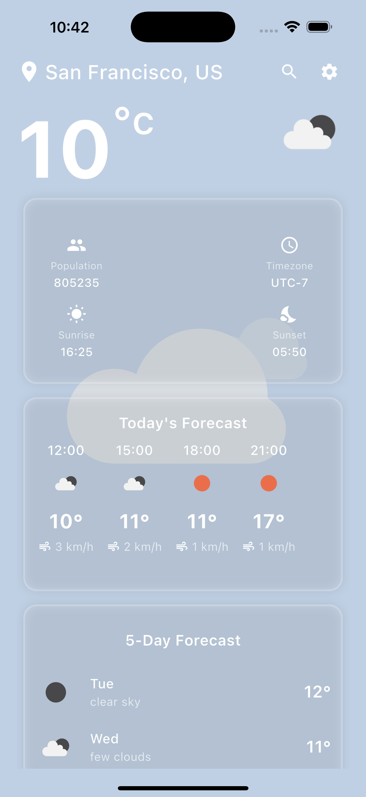
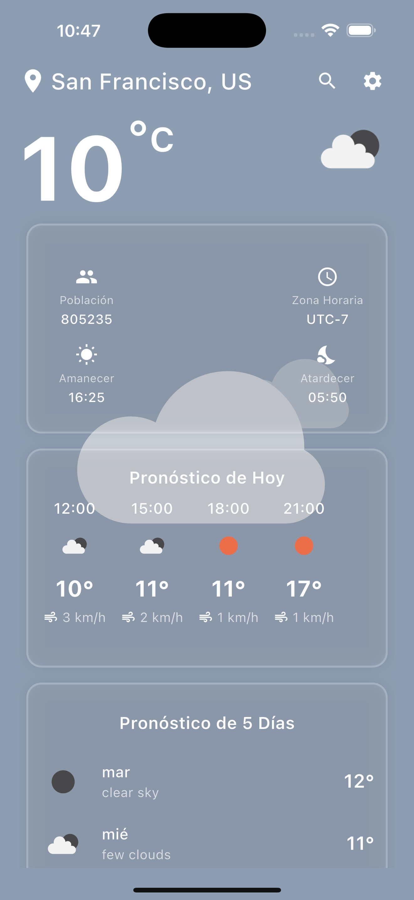
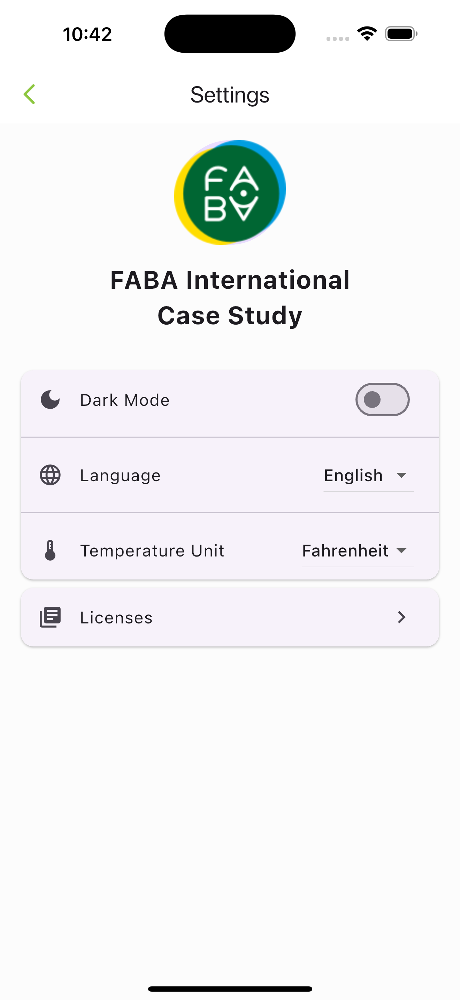
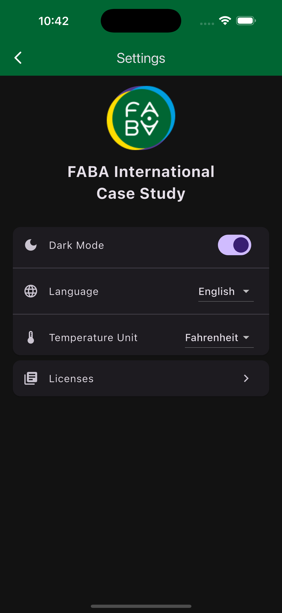
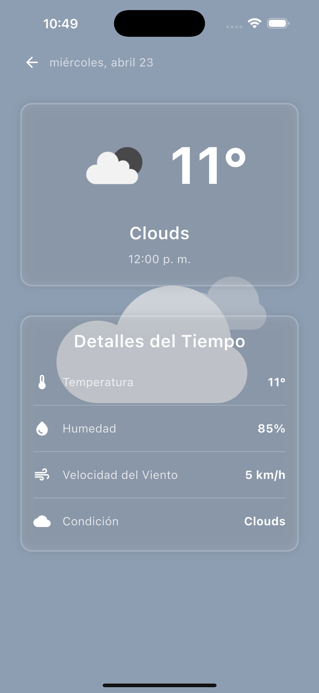

# Faba Weather App 🌤️

A beautiful and informative weather application built with Flutter, providing real-time weather information with a modern and intuitive user interface.

## 🌟 Features

- Real-time weather updates
- Location-based weather information
- Detailed weather forecasts
- Beautiful and responsive UI
- Dark/Light theme support
- Multi-language support

## 📱 Screenshots

### Screenshots

| Screen          | Description                                                 |
| --------------- | ----------------------------------------------------------- |
| Home            | Main weather screen showing current conditions and forecast |
| Home (ES)       | Spanish localized version of the home screen                |
| Settings        | App configuration screen for units, language, and theme     |
| Settings (Dark) | Dark theme version of settings screen                       |
| Detail          | Detailed weather information and extended forecast          |
| Detail (ES)     | Spanish localized version of detail screen                  |

| Screenshots         |                                                                     |                                                                          |
| ------------------- | ------------------------------------------------------------------- | ------------------------------------------------------------------------ |
| Home EN/ES          |      |        |
| Settings Light/Dark |  |  |
| Detail EN/ES        |    |      |

## 🏗️ Architecture

The project follows Clean Architecture principles with a clear separation of concerns:

```
lib/
├── config/         # App configuration, themes, routes
├── core/           # Core functionality, utilities, constants
├── data/           # Data layer
│   ├── datasources/    # Remote and local data sources
│   ├── models/         # Data models
│   └── repositories/   # Repository implementations
├── domain/         # Business logic layer
│   ├── entities/       # Business objects
│   ├── repositories/   # Repository interfaces
│   └── usecases/       # Use cases
└── presentation/   # UI layer
    ├── base/          # Base state and viewmodels
    ├── providers/     # Location, language, theme providers
    ├── screens/       # Screen widgets
    └── widgets/       # Reusable widgets
```

## 🚀 Getting Started

### Prerequisites

- Flutter SDK (latest stable version)
- Dart SDK
- Android Studio / VS Code
- iOS development tools (for iOS development)

### Installation

1. Clone the repository:

```bash
git clone https://github.com/mahmuthanb/faba_weather_app.git
cd faba_weather_app
```

2. Install dependencies:

```bash
flutter pub get
```

3. Run the following commands to generate necessary files:

```bash
# Generate localization files
flutter gen-l10n

# Generate code files (models, repositories, etc.)
flutter pub run build_runner build --delete-conflicting-outputs
```

### Running the App

#### Debug Mode

```bash
flutter run --dart-define=API_KEY=your_api_key_here
```

#### Release Mode

```bash
flutter run --release --dart-define=API_KEY=your_api_key_here
```

## 🛠️ Development Setup

### VS Code Launch Configuration

Create or update `.vscode/launch.json`:

```json
{
  "version": "0.2.0",
  "configurations": [
    {
      "name": "faba_weather_app",
      "request": "launch",
      "type": "dart",
      "args": ["--dart-define=API_KEY=your_api_key_here"]
    },
    {
      "name": "faba_weather_app debug",
      "request": "launch",
      "type": "dart",
      "flutterMode": "debug",
      "args": ["--dart-define=API_KEY=your_api_key_here"]
    }
  ]
}
```

## 📱 Supported Platforms

- iOS
- Android

## 🧪 Testing

Run tests using:

```bash
flutter test
```

## 📦 Dependencies

Key dependencies are listed in `pubspec.yaml`. The app uses:

- `flutter_bloc` for state management
- `dio` for network requests
- `get_it` for dependency injection
- And more...

## 👥 Authors

- Mahmuthan BARISIK ([@mahmuthanb](https://github.com/mahmuthanb))

## 🙏 Acknowledgments

- [OpenWeatherMap](https://openweathermap.org/api) API provider
